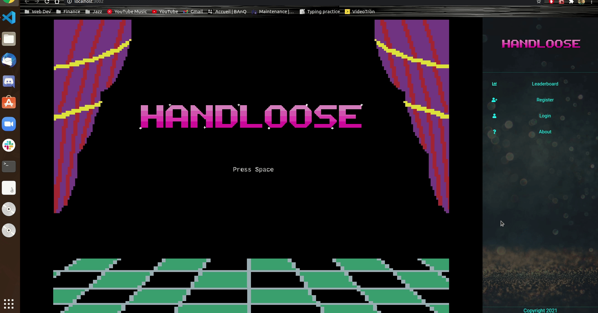
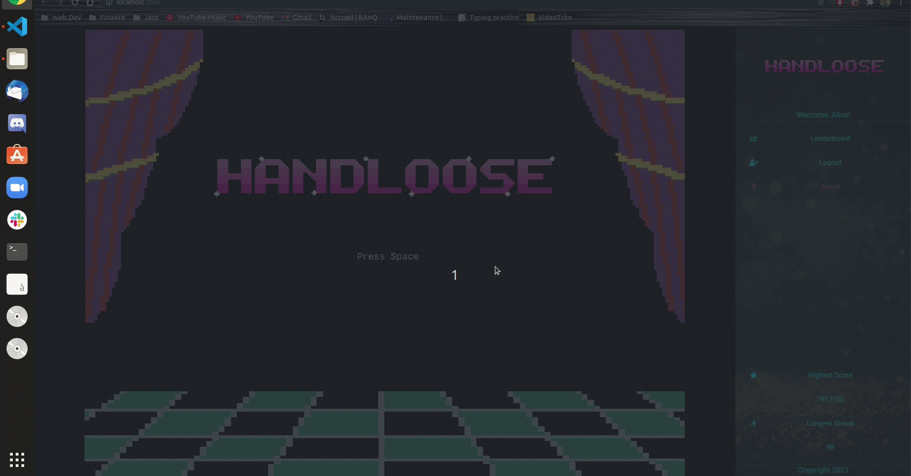
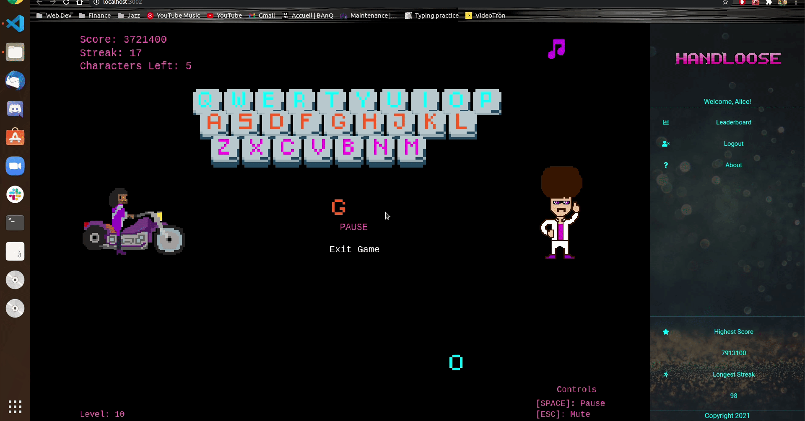
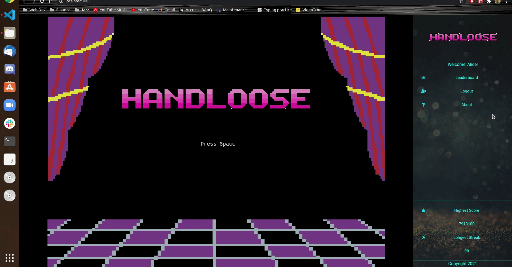

# HandLoose



## Description

This application will help individuals increase their keyboard typing skill whilst playing a game. [Below are screenshots of the project](#DEMO)

## Stack

1. ReactJS
2. Ruby on Rails
3. Bootstrap
4. Phaser

## Getting Started

In order to get your development environment set up.

1. Make sure you have Postgresql installed and make sure the server is running.
   To download [v14](https://www.postgresql.org/download/).
2. Make sure to `npm install` all dependencies inside CLIENT and `bundle install` all inside BACKEND.
3. Next run `bin/rails db:create` to create the required tables.
4. Then `bin/rails db:migrate`
5. Then `rake db:seed`

```
sudo service postgresql status/start/restart/stop
```

> **_NOTE:_** Make sure to npm install inside client and bundle install inside backend

### Client

- start development

```

npm start

```

- run jest

```

npm test

```

### Backend

- development server

```

rails s -b 0.0.0.0

```

The -b flag stands for IP binding, it will bind the server to localhost. This is only needed if using a VM.

> **_NOTE:_** You can use "rails s" simply if not using VM.

- test server

This has not been setup yet!

## DEMO




